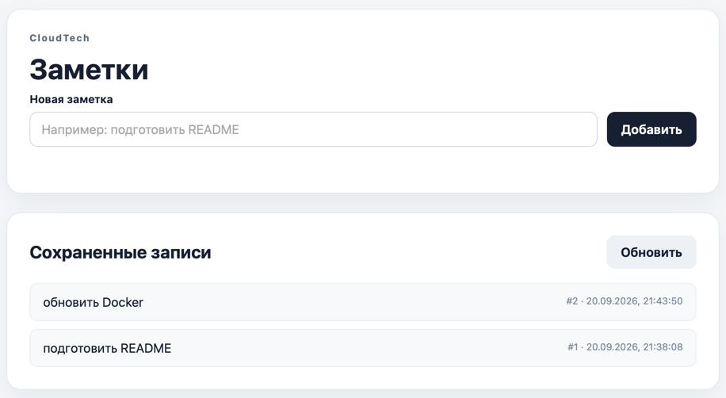
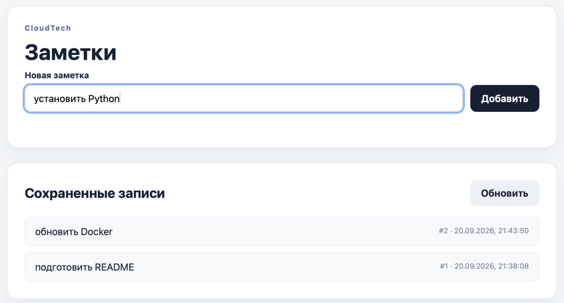
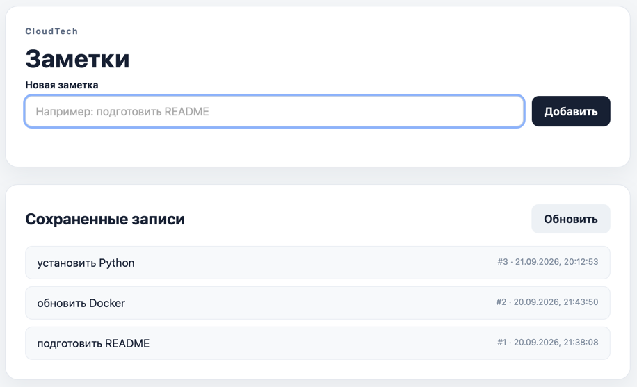
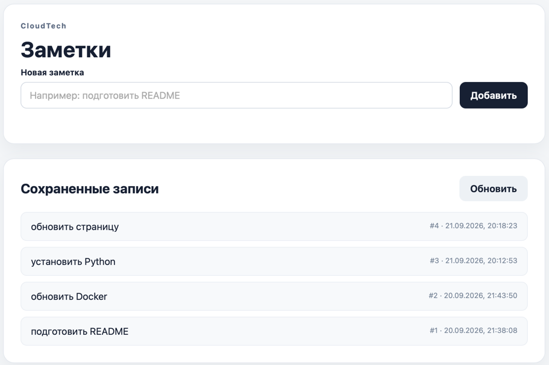
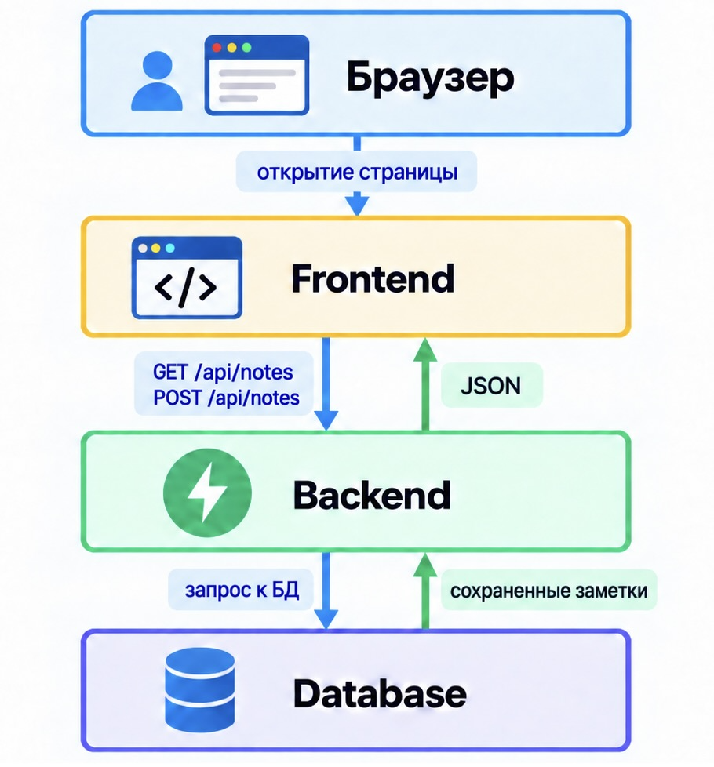

# Lab0 - небольшой сервис заметок для лабораторных работ по DevOps

Приложение представляет собой простой сервис заметок. Пользователь может открыть веб-страницу, добавить новую заметку и
увидеть ранее сохраненные записи.

## Функционал приложения

### 1. Просмотр сохраненных заметок

После открытия приложения пользователь видит список ранее сохраненных заметок в блоке **«Сохраненные записи»**. Для
каждой заметки пользователь может увидеть ее текст, номер и время создания.



Если сохраненных заметок пока нет, отображается сообщение **«Пока записей нет»**.

### 2. Создание новой заметки

Чтобы создать заметку, пользователь вводит текст в поле **«Новая заметка»** и нажимает кнопку **«Добавить»**.



После сохранения новая заметка появляется в списке на странице.



### 3. Обновление списка заметок

Пользователь может нажать кнопку **«Обновить»**, чтобы заново загрузить актуальный список сохраненных заметок.

### 4. Сохранение данных после обновления страницы

Если пользователь обновит страницу, ранее добавленные записи снова будут отображены в списке.



## Схема работы приложения

Приложение состоит из трех основных частей:

- **Frontend:** HTML + CSS + JavaScript. Отвечает за отображение интерфейса и взаимодействие пользователя с приложением.
- **Backend:** Python + FastAPI. Принимает запросы от Frontend и выполняет логику приложения.
- **Database:** PostgreSQL в контейнере Docker. Отвечает за постоянное хранение заметок.



Так как данные сохраняются в PostgreSQL, заметки остаются доступными после обновления страницы и перезапуска Backend.

## Запуск сервиса

### 0. Что нужно установить

- Python 3.11+
- Docker Desktop или Docker Engine с Docker Compose

### 1. Запустить PostgreSQL

Из корня проекта выполнить:

```bash
docker compose up -d db
```

### 2. Создать виртуальное окружение

Windows:

```bash
python -m venv .venv
.\.venv\Scripts\Activate.ps1
```

macOS / Linux:

```bash
python3 -m venv .venv
source .venv/bin/activate
```

### 3. Установить зависимости

```bash
pip install -r requirements.txt
```

### 4. Создать `.env` из `.env.example`

`.env.example` - шаблон конфигурации: в нем перечислены все переменные окружения, необходимые приложению.

Windows:

```bash
Copy-Item .env.example .env
```

macOS / Linux:

```bash
cp .env.example .env
```

Содержимое `.env.example`:

```env
POSTGRES_DB=labdb
POSTGRES_USER=labuser
POSTGRES_PASSWORD=labpassword
POSTGRES_HOST=localhost
POSTGRES_PORT=5432
```

Файл `.env` используется локально и не добавляется в Git-репозиторий.

### 5. Запустить FastAPI

```bash
uvicorn app.main:app --reload
```

После запуска доступны:

- приложение: http://127.0.0.1:8000
- Swagger UI: http://127.0.0.1:8000/docs
- health-check: http://127.0.0.1:8000/health