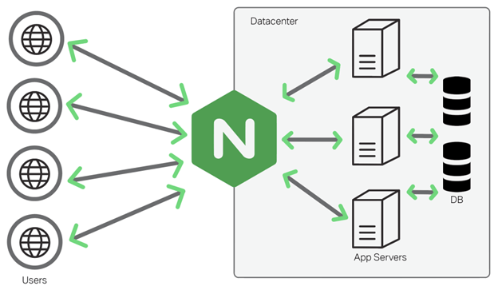
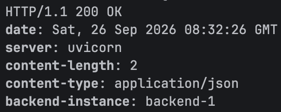
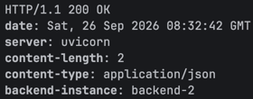
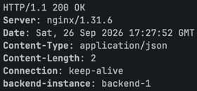
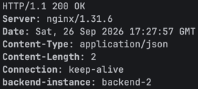
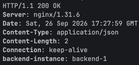
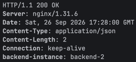
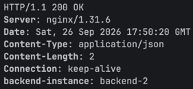

# Lab1 - NGINX

Цель - настроить веб-сервер NGINX перед Frontend и Backend, сделать из NGINX точку входа и балансировщик перед сервисом
из lab0.



## Этапы работы:

### Настройка индентификаторов инстансов backend.

Для начала мы добавили идентификатор экземпляра backend в заголовок ответа, чтобы понимать от какого инстанса backend
приходит ответ.

```bash
INSTANCE_ID = os.getenv("INSTANCE_ID", "unknown")
```

Также поскольку теперь за отдачу frontend будет отвечать NGINX мы убрали раздачу его файлов через сервис backend.

После этого из разных терминалов запустили два интстанса backend:

```bash
INSTANCE_ID=backend-1 uvicorn app.main:app --host 127.0.0.1 --port 8001
INSTANCE_ID=backend-2 uvicorn app.main:app --host 127.0.0.1 --port 8002
```

Теперь проверим их работу, используя curl и отправив запросы на два инстанса:

```bash
curl -i http://127.0.0.1:8001/api/notes
curl -i http://127.0.0.1:8002/api/notes
```

В ответ в заголовках получаем "backend-instance: backend-2" и "backend-instance: backend-1":




По итогу теперь у нас две одинаковые копии backend, работающие с одной базой данных, но имеющие разные идентификаторы.

### Настройка NGINX.

#### Установка.

Установили NGINX на пк. Пока без Docker :(.

У NGINX есть свой главный системный конфигурационный файл `nginx.conf`, лежащий в `/etc/nginx/nginx.conf` и отвечающий
за глобальную настройку NGINX. А дополнительные конфигурации для сайтов основной конфиг NGINX подключает из
`/etc/nginx/servers/`

НО нам нужно создать и хранить свою конфигурацию в директории проекта `/lab1/nginx/lab1.conf` и тогда возникает
проблема - NGINX ничего не знает о конфиг файле из нашего проекта, ведь он ищет конфигурации в своей собственной папке.

Поэтому чтобы каждый раз вручную не копировать туда наш собственный конфиг, можно создать ссылку на него из
`/etc/nginx/servers/`.
В итоге мы получим следующее: `/etc/nginx/servers/lab1.conf` -> `CloudTech/lab1/nginx/lab1.conf`.

Теперь настало время создать конфиг NGINX. Для этого я решил почитать несколько статей на Habr'е и посмотреть пару
роликов на YouTube, чтобы изучить основные команды и параметры конфигурационных файлов.

#### Балансировка между двумя инстансами backend + отказоустойчивость.

<details><summary>Напишем сначала часть конфигурации, отвечающую за балансировку запросов между двумя инстансами backend:</summary>

```bash
upstream notes_backend {
    server 127.0.0.1:8001;
    server 127.0.0.1:8002;
}

server {
    listen      8081;
    server_name localhost;

    location /api/ {
        proxy_pass http://notes_backend;
    }
}
```

</details>

Теперь отправим запрос не напрямую к инстансам backend, а уже через NGINX, причем, что важно, именно на один порт, за
которым стоит группа серверов:

```bash
curl -i http://localhost:8081/api/notes
```

! NGINX сам выбирает один из двух серверов группы notes_backend и отправляет запрос на него, балансирую между ними
запросы.

Теперь отправим несколько запросов подряд и посмотрим от какого инстанса придет ответ, чтобы проверить балансировку:

| № запроса | Ответ                                                    | Инстанс backend |
|-----------|----------------------------------------------------------|-----------------|
| 1         |  | backend-1       |
| 2         |  | backend-2       |
| 3         |  | backend-1       |
| 4         |  | backend-2       |

В результате получаем чередование двух инстансов backend.

То есть клиент теперь не обращается к конкретному экземпляру backend. Единой точкой входа становится NGINX, который
самостоятельно распределяет запросы между двумя инстансами, балансирую входящий трафик.

Пришло время проверить работу сервиса при падении одного из экзмепляров backend. Для этого остановим один из
экземпляров (backend-1) и заново отправим запрос:


Несмотря на то, что первый backend больше не работает, мы все равно получили успешный ответ, ведь повторные запросы
продолжают обрабатываться вторым работающим экземпляром backend.

То есть NGINX исключает недоступные инстансы из обработки запросов и перенаправляет трафик на оставшиеся в группе
инстансы.

#### Маршрутизация / обработка запросов + раздача файлов самим NGINX.

Для этой части работы мы сначала написали три простых статичных странички: `docs/index.html`, `site2/index.html`,
`errors/404.html`

Так как несколько виртуальных серверов могут слушать ОДИН порт, то NGINX сам выбирает нужный по полю `Host` в заголовке
HTTP[S]-запроса. По этой же причине, если поступит запрос на неизвестный `Host`, то NGINX не будет знать куда именно его
перенаправить, что приведет нас к непредсказуемому поведению, поэтому мы добавим
<details><summary><b>дефолтный виртуальный сервер, который будет возвращать 404.</b></summary>

```bash
server {
    listen      8081 default_server;
    server_name _;

    error_page 404 /404.html;

    location = /404.html {
        root     /Users/denisbaranov/cs_projects/3s/CloudTech/lab1/nginx/errors;
        internal;
    }
    
    location /error-assets/ {
        alias /Users/denisbaranov/cs_projects/3s/CloudTech/lab1/nginx/errors/assets/;
    }

    location / {
        return 404;
    }
```

</details>

Чтобы NGINX разводил запросы по доменам и чужой домен не отдавал ничего лишнего, настроим несколько локальных доменных
имен (прописывем маршруты в конфиг файл системы `/etc/hosts`) на одном сервере (то есть локально на пк, ведь пока
сервера не в интернете):

```bash
notes.local -> 127.0.0.1
site2.local -> 127.0.0.1
```

<details><summary>Сделаем так, чтобы теперь backend вообще не отвечал за раздачу файлов frontend, а все их передавал сам NGINX, при этом запросы на `/api` проксировал на backend:</summary>

```bash
upstream notes_backend {
    server 127.0.0.1:8001;
    server 127.0.0.1:8002;
}

server {
    listen      8081 default_server;
    server_name _;

    return 404;
}

server {
    listen      8081;
    server_name notes.local;

    root  /Users/denisbaranov/cs_projects/3s/CloudTech/lab1/frontend;
    index index.html;

    error_page 404 /404.html;

    location = /404.html {
        root     /Users/denisbaranov/cs_projects/3s/CloudTech/lab1/nginx/errors;
        internal;
    }
    
    location /error-assets/ {
        alias /Users/denisbaranov/cs_projects/3s/CloudTech/lab1/nginx/errors/assets/;
    }

    location /api/ {
        proxy_pass http://notes_backend;
    }

    # делаем редирект на /docs/
    location = /docs {
        return 301 /docs/;
    }

    location /docs/ {
        alias /Users/denisbaranov/cs_projects/3s/CloudTech/lab1/nginx/docs/;
        index index.html;
    }

    location / {
        try_files $uri $uri/ =404;
    }
}

server {
    listen      8081;
    server_name site2.local;

    root  /Users/denisbaranov/cs_projects/3s/CloudTech/lab1/nginx/site2;
    index index.html;

    error_page 404 /404.html;

    location = /404.html {
        root     /Users/denisbaranov/cs_projects/3s/CloudTech/lab1/nginx/errors;
        internal;
    }
    
    location /error-assets/ {
        alias /Users/denisbaranov/cs_projects/3s/CloudTech/lab1/nginx/errors/assets/;
    }

    location / {
        try_files $uri $uri/ =404;
    }
}

```

</details>

И на данном этапе при запросе `http://notes.local:8081` мы уже попадаем на главную страницу сайта:


А при запросе на `http://site2.local:8081/` мы попадем на вторую небольшую страничку на этом же порту, но по другому
хосту, никак не связанному с нашим основным сервисом:


! При запросе на неизвестное никому доменное имя `http://unknown.local:8081/` нас перебросит на кастомную 404 страницу:


<details><summary>Маленькая попутная неприятность:</summary>
Изначально у меня не подтягивалась картинка для страницы 404 ошибки, проблема была в том, что я использовал не
абсолютный путь, который подставлялся ко всем запросам, решением стало как раз использование `alias`.
</details>

#### HTTPS (создание сертификата) + админка + ограничение флуда запросами.

Начнем с создания самоподписанного сертификата (`nginx/certs` - здесь лежат сертификаты и приватные ключи сертификатов):

```bash
# запускает не системную утилиту, а установленную именно через Homebrew
$(brew --prefix openssl@3)/bin/openssl req \
  -x509 \
  -nodes \
  -days 365 \
  -newkey rsa:2048 \
  -keyout nginx/certs/lab1.key \
  -out nginx/certs/lab1.crt \
  -subj "/CN=notes.local/O=CloudTech/C=RU" \
  -addext "subjectAltName=DNS:notes.local,DNS:site2.local,DNS:unknown.local,DNS:localhost"
```

<details><summary><b>Разбор данной команды на косточки:</b></summary>

`openssl req` - утилита для работы с ssl-запросами, позволяющая создавать самоподписанные сертификаты.

`-x509` - сразу создать готовый самоподписанный сертификат вместо запроса на его получение.

`-nodes` - не шифровать приватный ключ паролем.

`-days [кол-во дней]` - задать срок действия сертификата в днях.

`-newkey rsa:[длина ключа]` - создать новый приватный RSA-ключ указанной длины.

`-keyout [путь]` - указать путь, куда будет сохранен приватный ключ.

`-out [путь]` - указать путь, куда будет сохранен сертификат.

`-subj "[данные владельца]"` - задать информацию о владельце сертификата, где

`CN=[доменное имя]` - основное доменное имя, для которого создается сертификат.

`O=[организация]` - название организации, для которой создается сертификат.

`C=[код страны]` - код страны владельца сертификата.

`-addext "subjectAltName=DNS:[домен1],DNS:[домен2],..."` - добавить дополнительные доменные имена, для которых
сертификат тоже будет действителен.
</details>

Теперь создадим отдельного пользователя `admin` и добавим ему панель админа `frontend/admin/index.html`. Воспользуемся
специальной утилитой `htpasswd` для настройки Basic Auth для /admin (логин / пароль = `admin`):

```bash
htpasswd -c nginx/.htpasswd admin
```

После чего в файле `.htpasswd` у нас будут лежать строки вида `логин:хеш_пароля`.

<details><summary><b>В итоге мы пришли к следующему конфигу NGINX:</b></summary>

```bash
# ограничение кол-ва запросов к /api (3 запроса в секунду с одного IP)
limit_req_zone $binary_remote_addr zone=api_limit:10m rate=3r/s;

upstream notes_backend {
    server 127.0.0.1:8001;
    server 127.0.0.1:8002;
}


# редирект HTTP -> HTTPS
server {
    listen      80;
    server_name notes.local site2.local;

    return 301 https://$host$request_uri;
}


# неизвестные домены через HTTP-запросы
server {
    listen      80 default_server;
    server_name _;

    error_page 404 /404.html;

    location = /404.html {
        root     /Users/denisbaranov/cs_projects/3s/CloudTech/lab1/nginx/errors;
        internal;
    }

    location /error-assets/ {
        alias /Users/denisbaranov/cs_projects/3s/CloudTech/lab1/nginx/errors/assets/;
    }

    location / {
        return 404;
    }
}


# неизвестные домены через HTTPS-запросы
server {
    listen      443 ssl default_server;
    server_name _;

    # самоподписанный сертификат и приватный ключ сертификата
    ssl_certificate     /Users/denisbaranov/cs_projects/3s/CloudTech/lab1/nginx/certs/lab1.crt;
    ssl_certificate_key /Users/denisbaranov/cs_projects/3s/CloudTech/lab1/nginx/certs/lab1.key;

    error_page 404 /404.html;

    location = /404.html {
        root     /Users/denisbaranov/cs_projects/3s/CloudTech/lab1/nginx/errors;
        internal;
    }

    location /error-assets/ {
        alias /Users/denisbaranov/cs_projects/3s/CloudTech/lab1/nginx/errors/assets/;
    }

    location / {
        return 404;
    }
}


# notes.local
server {
    listen      443         ssl;
    server_name notes.local;

    # самоподписанный сертификат и приватный ключ сертификата
    ssl_certificate     /Users/denisbaranov/cs_projects/3s/CloudTech/lab1/nginx/certs/lab1.crt;
    ssl_certificate_key /Users/denisbaranov/cs_projects/3s/CloudTech/lab1/nginx/certs/lab1.key;

    root  /Users/denisbaranov/cs_projects/3s/CloudTech/lab1/frontend;
    index index.html;

    error_page 404 /404.html;

    location = /404.html {
        root     /Users/denisbaranov/cs_projects/3s/CloudTech/lab1/nginx/errors;
        internal;
    }

    location /error-assets/ {
        alias /Users/denisbaranov/cs_projects/3s/CloudTech/lab1/nginx/errors/assets/;
    }

    # api
    location /api/ {
        limit_req        zone=api_limit;
        limit_req_status 429;

        proxy_pass http://notes_backend;
    }

    # документация
    location = /docs {
        return 301 /docs/;
    }

    location /docs/ {
        alias /Users/denisbaranov/cs_projects/3s/CloudTech/lab1/nginx/docs/;
        index index.html;
    }

    # админка
    location = /admin {
        return 301 /admin/;
    }

    location /admin/ {
        # включаем Basic Auth
        auth_basic           "Admin panel";
        # файл пользователей и хешей их паролей
        auth_basic_user_file /Users/denisbaranov/cs_projects/3s/CloudTech/lab1/nginx/.htpasswd;

        try_files $uri $uri/ =404;
    }

    location / {
        try_files $uri $uri/ =404;
    }
}


# site2.local
server {
    listen      443         ssl;
    server_name site2.local;

    # самоподписанный сертификат и приватный ключ сертификата
    ssl_certificate     /Users/denisbaranov/cs_projects/3s/CloudTech/lab1/nginx/certs/lab1.crt;
    ssl_certificate_key /Users/denisbaranov/cs_projects/3s/CloudTech/lab1/nginx/certs/lab1.key;

    root  /Users/denisbaranov/cs_projects/3s/CloudTech/lab1/nginx/site2;
    index index.html;

    error_page 404 /404.html;

    location = /404.html {
        root     /Users/denisbaranov/cs_projects/3s/CloudTech/lab1/nginx/errors;
        internal;
    }

    location /error-assets/ {
        alias /Users/denisbaranov/cs_projects/3s/CloudTech/lab1/nginx/errors/assets/;
    }

    location / {
        try_files $uri $uri/ =404;
    }
}
```

</details>


<details><summary>Маленькая попутная неприятность:</summary>
На macOS / Linux порты 80 и 443 являются привилегированными, поэтому при запуске NGINX под обычным пользователем получаем `Permission denied`, поэтому запускаем NGINX через sudo.

Также хоть и главный процесс NGINX мы запускаем теперь от root, но внутренние процессы продолжают работать от
непривелигированного пользователя, поэтому они не имеют доступа к нашей пользовательской директории проекта.
Я нашел следующее решение, мы можем в начало главного кофинга NGINX добавить строку
`user [имя пользователя] [группа пользователя]`, указывающую от какого пользователя и группы будут работать внутренние
процессы NGINX.
</details>

<details><summary>Еще один интересный момент.</summary>
Так как сертификат мы подписали сами, то и curl, и браузер ему не доверяют, поэтому приходится вручную доверять сертификату :).
</details>

<details><summary><b>В процессе выполнения работы для себя я создал небольшую справку по основным командам и параметрам для настройки `*.conf`.</b></summary>

`upstream [имя группы серверов] {...}` - создать группу из нескольких серверов под одним логическим именем.

`server {...}` - блок настройки отдельного виртуального сервера NGINX.

`listen [порт]` - указать порт, на котором виртуальный сервер будет принимать запросы.

`ssl` - указать, что виртуальный сервер должен принимать HTTPS-запросы.

`default_server` - флаг, означающий, что если NGINX не найдет другой `server` с подходящим `server_name`, то запрос
будет отправлен сюда.

`server_name [имя виртуального сервера]` - задать имя (`Host`) виртуального сервера, чтобы NGINX мог отличить
запросы, приходящие на один порт.

`location (=) [путь] {...}` - задать правила для обработки всего, что приходит на `/[путь]/...`.

! `location / {...}` - задать правила для обработки всего, что приходит на `/`, то есть для всех неописанных запросов.

`try_files [путь1] [путь2] ... [действие если ничего не найдено]` - последовательно проверить указанные пути и
использовать первый найденный, а если ничего не найдено, то выполнить последнее указанное действие.

`root [путь]` - задать основную директорию, где NGINX будет искать статические файлы сайта. URI **добавляется** к
указанному пути.

`alias [путь]` - задать для `location` конкретную директорию. НО, в отличие от `root`, совпавшая часть URI
**заменяется** указанным путем.

`proxy_pass [http[s]://[имя группы серверов]]` - передать запрос одному из серверов группы.

`return 301 [адрес]` - сделать редирект клиента на указанный адрес.

`limit_req_zone [ключ] zone=[имя зоны]:[размер] rate=[частота]` - создать зону разделяемой памяти для ограничения
частоты входящих запросов от клиентов, где

`[ключ]` - параметр, по которому просиходит отслеживание.

`zone=[имя зоны]:[размер]` - имя зоны и ее объем.

`rate=[частота]` - лимит обработки запросов.

`auth_basic "[имя защищенной области]"` - включить HTTP Basic Authentication для данного `location`.

</details>

В качестве краткой демонстрации результатов в этом разделе, покажем работающую панель админа при переходе на
`https://notes.local/admin`:


### Сбор результатов.

Создадим скрипт `check.sh`, состоящйи из отдельных блоков команд, который поможет нам быстро собрать всю информацию по
настроенной конфигурации NGINX и проверить корректность и работоспособность системы:

<details><summary>Листинг скрипта.</summary>

```bash
#!/bin/bash


echo "Проверка редиректа HTTP -> HTTPS:"
curl -I http://notes.local/


echo "Проверка работы сайта по HTTPS:"
curl -sk -I https://notes.local/


echo "Проверка балансировки между двумя инстансами backend:"
for i in {1..6}
do
  curl -sk -i https://notes.local/api/notes | grep "backend-instance"
  sleep 1
done


echo "Проверка доступа к /admin без авторизации:"
curl -sk -I https://notes.local/admin/


echo "Проверка ограничения количества запросов к /api:"
for i in {1..6}
do
  curl -sk -I https://notes.local/api/notes &
done

wait


echo "Проверка виртуального хоста notes.local:"
curl -sk https://notes.local/ | grep "<title>"


echo "Проверка виртуального хоста site2.local:"
curl -sk https://site2.local/ | grep "<title>"


echo "Проверка неизвестного домена:"
curl -sk -i -H "Host: unknown.local" https://127.0.0.1/ | grep "HTTP/"


echo "Проверка собственной страницы 404:"
curl -sk -i https://notes.local/not-existing-page | grep "Ошибка 404"


echo "Проверка отказоустойчивости при падении одного инстанса backend:"
pkill -f "uvicorn.*--port 8001"
sleep 1

for i in {1..6}
do
  curl -sk -i https://notes.local/api/notes | grep "backend-instance"
  sleep 1
done
```

</details>


<details><summary>Вывод скрипта и анализ полученных ответов:</summary>

```bash
Проверка редиректа HTTP -> HTTPS:
HTTP/1.1 301 Moved Permanently
Location: https://notes.local/
# HTTP-запрос перенаправляется на HTTPS, как и требовалось.


Проверка работы сайта по HTTPS:
HTTP/1.1 200 OK
# Сайт открывается по HTTPS, как и требовалось.


Проверка балансировки между двумя инстансами backend:
backend-instance: backend-1
backend-instance: backend-2
backend-instance: backend-1
backend-instance: backend-2
backend-instance: backend-1
backend-instance: backend-2
# Ответы приходят от обоих инстансов backend, то есть происходит балансировка, как и требовалось.


Проверка доступа к /admin без авторизации:
HTTP/1.1 401 Unauthorized
WWW-Authenticate: Basic realm="Admin panel"
# Без логина и пароля доступ к панели админа запрещен, то есть авторизация работает, как и требовалось.


Проверка ограничения количества запросов к /api:
HTTP/1.1 429 Too Many Requests
HTTP/1.1 429 Too Many Requests
HTTP/1.1 429 Too Many Requests
HTTP/1.1 429 Too Many Requests
HTTP/1.1 429 Too Many Requests
# При большом потоке запросов NGINX возвращает 429 ошибку, то есть ограничение на кол-во отправленных запросов рабоатет, как и требовалось.


Проверка виртуального хоста notes.local:
<title>Notes Service</title>
# Для notes.local отдается только его страница, как и требовалось.


Проверка виртуального хоста site2.local:
<title>Site2</title>
# Для site2.local отдается другая собственная страница, то есть виртуальные хосты разделены, как и требовалось.


Проверка неизвестного домена:
HTTP/1.1 404 Not Found
# Неизвестный домен не попадает на существующие хосты, а возвращается 404 ошибка, как и требовалось.


Проверка собственной страницы 404:
<h1>Ошибка 404</h1>

# Используется кастомная страница 404 ошибки, как и требовалось.


Проверка отказоустойчивости при падении одного инстанса backend:
backend-instance: backend-2
backend-instance: backend-2
backend-instance: backend-2
backend-instance: backend-2
backend-instance: backend-2
backend-instance: backend-2
# После остановки backend-1 сервис продолжает работать через backend-2, то есть отказоустойчивость обеспечена, как и требовалось.
```

</details>

## Выводы.

Еще раз зафиксируем то, что нам показалось наиболее важным и интересным после выполнения работы:

1. NGINX удобно ставить перед приложением как единую точку входа.
2. Через upstream можно распределять запросы между несколькими инстансами из группы.
3. При падении одного сервера из группы сервис продолжает работать, используя оставшиеся.
4. Один NGINX может одновременно обслуживать несколько сайтов (даже на одном порту) и по-разному обрабатывать разные
   пути.
5. Настройка базовой защиты приложения от флуда запросами.
6. Существенная часть сетевой логики может быть настроена именно через конфигурацию NGINX.