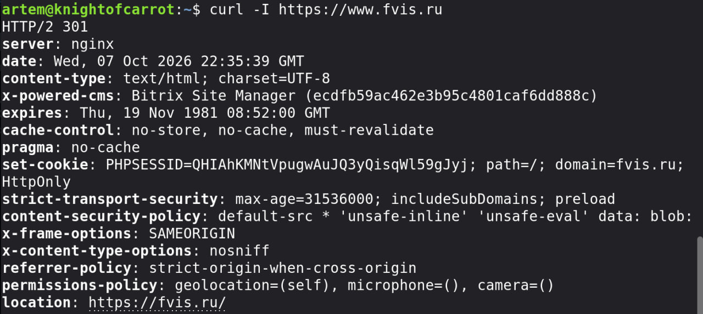
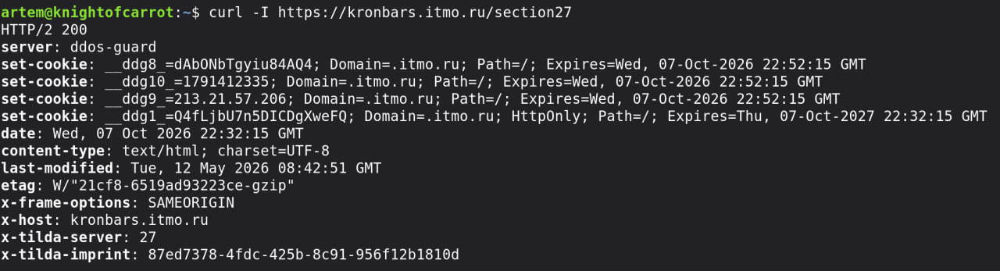
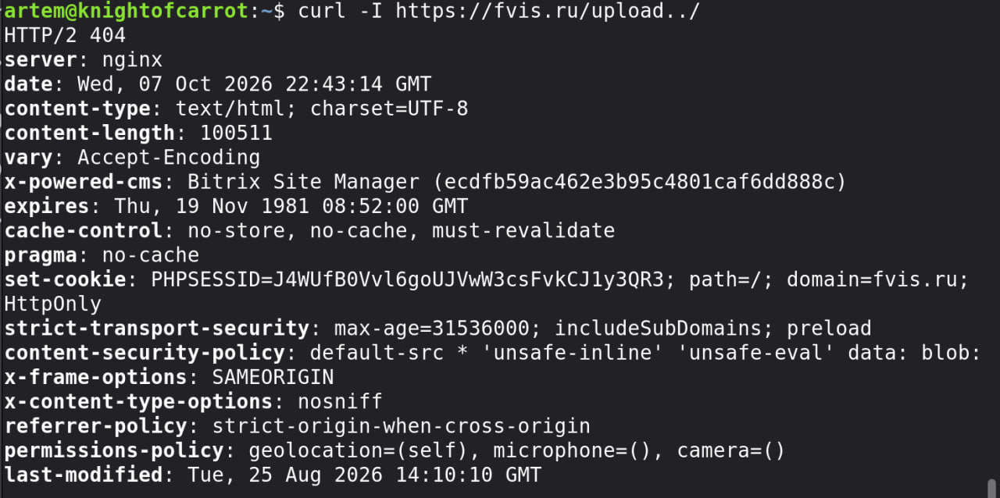
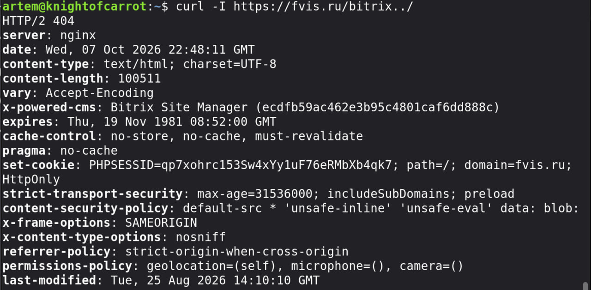
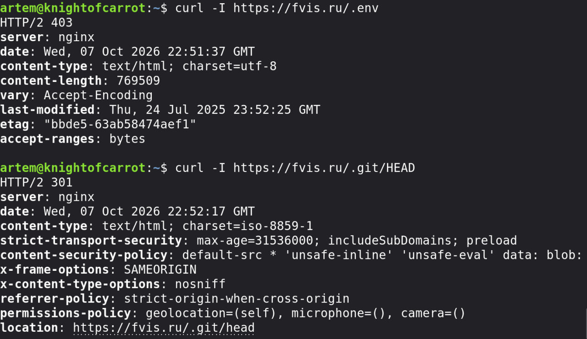
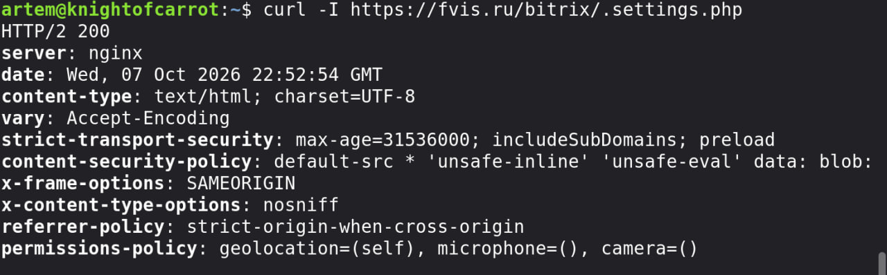
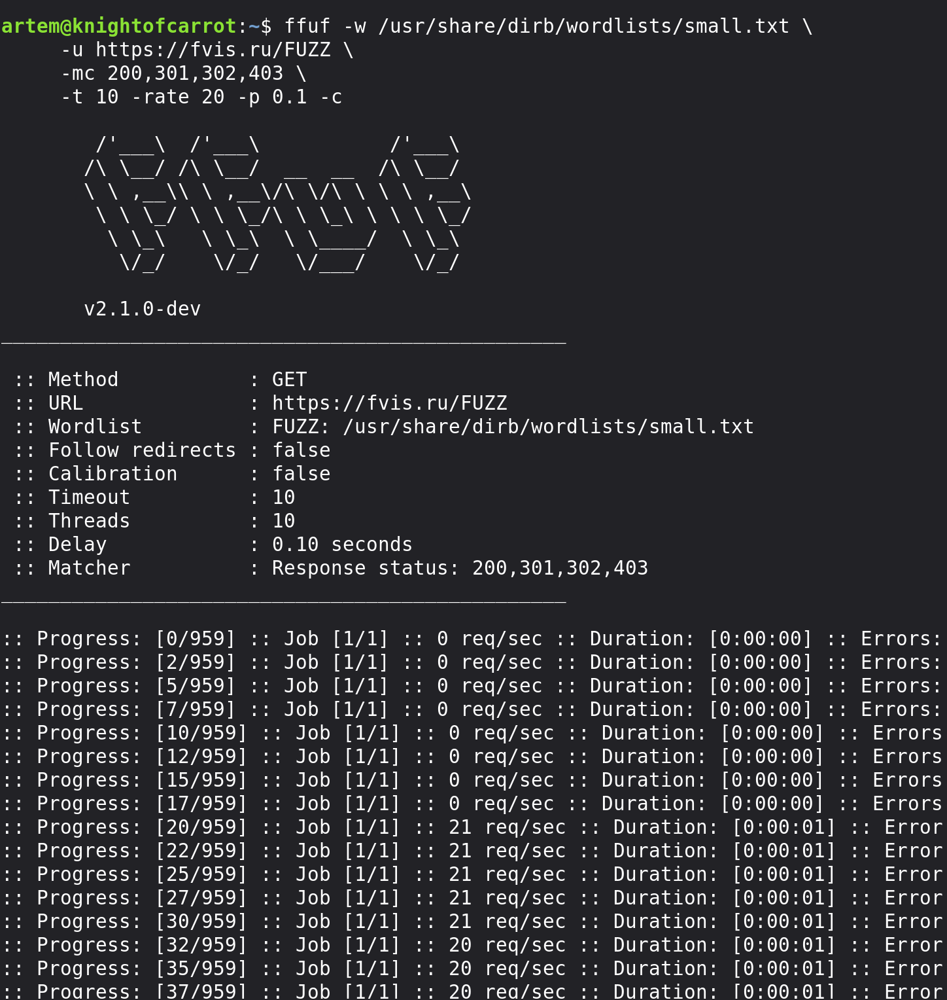
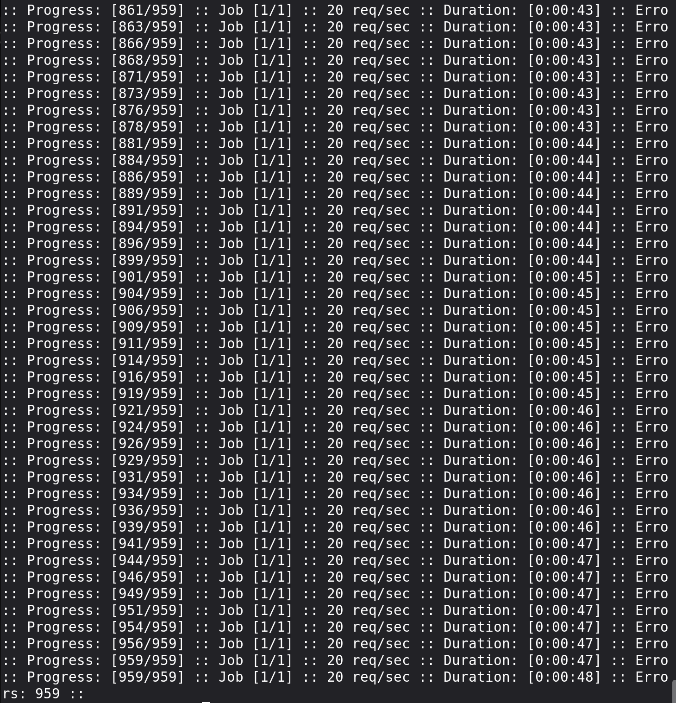

# Часть со звёздочкой - Проверка уязвимостей конфигурации Nginx

Целевой ресурс: `https://fvis.ru` (Сервер: Nginx, CMS: 1C-Битрикс)

Фан-факт: Изначально планировался сайт по парусному спорту ИТМО, но там не Nginx

## В ходе выполнения задания были проверили 3 популярных уязвимостей в конфигурации Nginx:

#### Проверка уязвимости Alias Path Traversal:

Получили `HTTP/2 404` 

Аналогично `HTTP/2 404` -> сервер корректно обрабатывает `../` в URL и не отдаёт содержимое родительских директорий

Микрофишка: Чтобы curl скрыл шкалу прогресса, но при этом напечатал только HTTP-заголовки ответа использовали флаг `-I`

**Вывод:** Конфигурация директив `location` / `alias` безопасна, выход за пределы папок заблокирован

#### Доступ к служебным и скрытым файлам:

`curl -I https://fvis.ru/.env` возвращает `HTTP/2 403` -> Nginx заблокировал доступ к `.env` файлу

`curl -I https://fvis.ru/.git/HEAD` возвращает `HTTP/2 301` -> Будто папка доступна снаружи, а с ней весь код проекта - потенциальная угроза. Но на деле перенаправляется на несуществующую страницу, так что утечки не происходит

`curl -I https://fvis.ru/bitrix/.settings.php`возвращает `HTTP/2 200` - Это уже опасно, там хранятся важные настройки, которые не должны утекать.
 Но из заголовка `content-type: text/html; charset=UTF-8` интерпритатор просто исполняет файл, не выдаёт исходный код -> код конфига с паролями не утёк 

 **Вывод:** Nginx корректно закрывает доступ к служебным файлам

#### Перебор директорий и файлов

Сделали небольшой прогон. В итоге скрытых файлов и директорий не было найдено

**Итог:** Попытки поиска уязвимостей в конфигурации Nginx целевого сайта не выявили критических утечек данных. Сервер настроен безопасно.