# Lab2 - Docker

Цель - упаковать сервис в Docker-образы и поднять frontend, backend и db через Docker Compose.


## Этапы работы:

### Плохой Dockerfile

Сначала создадим Dockerfile_bad, в котором рассмотрим `bad practices`.

<details><summary><b>BAD Dockerfile</b></summary>

```dockerfile
# Не фиксируем версию образа, что уменьшает стабильность и предсказуемость сборки
# Используем полный image вместо облегченного alpine/slim
FROM python:latest

WORKDIR /app

# Копируем весь проект, поэтому в image попадают лишние файлы
COPY . .

# Устанавливаем зависимости после COPY . .
# При любом изменении кода сбрасываем кеш и заново устанавливаем пакеты, хотя сами зависимости не изменились
RUN pip install -r requirements.txt

EXPOSE 8000

# Не создаем отдельного пользователя, поэтому запускаем приложение от root, у которого есть полные права внутри контейнера
# Не добавляем HEALTHCHECK, поэтому Docker не проверяет, действительно ли приложение работает
# Не используем multi-stage build, поэтому не отделяем build-окружение от итогового image, что может увеличить его размер
# Записываем CMD в shell-форме (shell-форма - для сложных команд с возможностями shell-оболочки, а exec-форма - для четких простых команд без оболочки)
CMD uvicorn backend.main:app --host 0.0.0.0 --port 8000
```

</details>

---

### Хороший Dockerfile

Теперь исправим эти проблемы и добавим еще несколько улучшений, чтобы прокачать наш образ.

<details><summary><b>GOOD Dockerfile</b></summary>

```dockerfile
# Stage 1 - устанавливаем зависимости
# Фиксируем версию образа, что делает сборку более стабильной и предсказуемой
# Используем облегченный alpine image
FROM python:3.12.7-alpine AS builder

WORKDIR /build

# Сначала копируем только файл зависимостей, тогда если зависимости не изменились, то будет использован закешированный слой Docker
COPY requirements.txt .

# Создаем виртуальное окружение и устанавливаем зависимости
# С помощью --no-cache-dir не сохраняем кеш пакетного менеджера, чтобы не увеличивать размер image
RUN python -m venv /venv
RUN /venv/bin/pip install --no-cache-dir -r requirements.txt


# Stage 2 - создаем итоговый image
# Благодаря multi-stage build не переносим лишнее build-окружение в итоговый image
FROM python:3.12.7-alpine

WORKDIR /app

# Устанавливаем curl для HEALTHCHECK
# С помощью --no-cache опять не сохраняем кеш пакетного менеджера, чтобы не увеличивать размер image
RUN apk add --no-cache curl

# Создаем отдельную группу и пользователя, чтобы не запускать приложение от root
RUN addgroup -S appgroup && adduser -S appuser -G appgroup

# Копируем из первого этапа только готовое виртуальное окружение с зависимостями
COPY --from=builder /venv /venv

# В итоговый image копируем только backend, т.к. этот Dockerfile собирает только образ backend
# И сразу назначаем обычного пользователя appuser владельцем файлов
COPY --chown=appuser:appgroup backend ./backend

# Добавляем виртуальное окружение в переменную среды PATH, чтобы иметь возможность запускать установленные команды напрямую
ENV PATH="/venv/bin:$PATH"

# Запускаем приложение от созданного пользователя, а не от root
USER appuser

EXPOSE 8000

# Используем HEALTHCHECK, чтобы проверить, что backend сервис отвечает
HEALTHCHECK --interval=10s --timeout=3s --start-period=10s --retries=3 \
     CMD curl -fs http://127.0.0.1:8000/health

# Записываем CMD в exec-форме, чтобы запускать команду напрямую в контейнере без shell-оболочки
CMD ["uvicorn", "backend.main:app", "--host", "0.0.0.0", "--port", "8000"]
```

</details>

Также добавим `.dockerignore` файл, чтобы исключить из контекста сборки ненужные файлы и директории: локальное
окружение, `.env`, Git, кеш Python и т.п.

---

### Плохой Dockerfile VS Хороший Dockerfile

Соберем оба image и сравним их по размеру, пользователю внутри контейнера и скорости повторной сборки.

#### Сравнение размеров

```bash
docker build -f backend/Dockerfile_bad -t notes-backend:bad .
docker build -f backend/Dockerfile_good -t notes-backend:good .

docker image ls notes-backend
```


Видим, что контейнер собранный из хорошего образа получился примерно в 8 раз меньше за счет облегченной базы,
многоэтапной сборки и отсутствия
ненужных файлов в итоговом образе.

#### Проверка пользователя

```bash
docker run -d --name backend-bad notes-backend:bad sleep 500
docker run -d --name backend-good notes-backend:good sleep 500

docker exec backend-bad whoami
docker exec backend-good whoami
```

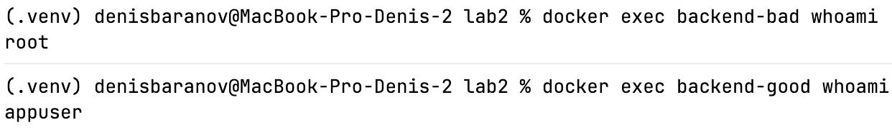

Видим, что контейнер собранный из хорошего образа работает от отдельного пользователя `appuser`, а не от `root`. То есть
мы ограничили права процесса внутри контейнера и приложение получает только необходимые ему для работы права.

#### Проверка кеша и времени повторной сборки

Изменим одну строку в `backend/main.py`, не изменяя зависимостей в `requirements.txt`, и повторим сборку обоих образов.

| Image |                                                   Время повторной сборки |
|-------|-------------------------------------------------------------------------:|
| bad   |    |
| good  |  |

Видим, что повторная сборка хорошего image заняла **0.6 s**, плохого - **17.6 s**.

В плохом Dockerfile любое изменение кода сбрасывает кеш слоя с зависимостями, поэтому они переустанавливаются заново.
В хорошем Dockerfile зависимости кешируются отдельно и не переустанавливаются при любом изменении кода, если файл
зависимостей не изменялся.

---

### Frontend image

Создадим также свой Dockerfile для сервиса Frontend, работающего на NGINX.

<details><summary><b>Dockerfile</b></summary>

```dockerfile
# Фиксируем версию образа, что делает сборку более стабильной и предсказуемой
# Используем облегченный alpine image
FROM nginx:1.27.4-alpine

# Удаляем дефолтный конфиг NGINX (у нас свой)
RUN rm /etc/nginx/conf.d/default.conf

# Копируем собственный конфиг NGINX и переносим Frontend
COPY nginx/nginx.conf /etc/nginx/conf.d/default.conf
COPY frontend/ /usr/share/nginx/html/

EXPOSE 80

# Используем HEALTHCHECK, чтобы проверить, что frontend сервис отвечает
HEALTHCHECK --interval=10s --timeout=3s --start-period=5s --retries=3 \
    CMD curl -fs http://127.0.0.1/healthz
```

</details>

---

### Docker Compose

Для запуска всего приложения создадим `docker-compose.yml` файл, который позволит работать сразу с тремя сервисами
(`frontend`, `backend`, `db`) и связать их между собой:

```text
frontend (NGINX) -> frontend_net -> backend (FastAPI) -> backend_net -> db (PostgreSQL)
```

<details><summary><b>Docker-Compose</b></summary>

```yaml
services:
  db:
    # Используем облегченный образ PostgreSQL
    image: postgres:16-alpine
    container_name: lab2-db

    # Захватываем переменнные БД из переменных окружения
    environment:
      POSTGRES_DB: ${POSTGRES_DB}
      POSTGRES_USER: ${POSTGRES_USER}
      POSTGRES_PASSWORD: ${POSTGRES_PASSWORD}

    # Храним данные БД в именованном томе, чтобы обеспечить их персистентность (путь, который нужно указать прописан на странице образа на Docker Hub)
    volumes:
      - postgres_data:/var/lib/postgresql/data

    # db подключен только к сети backend
    networks:
      - backend_net

    # Автоматически перезапускаем контейнер при аварийном завершении
    restart: unless-stopped

    # Проверяем готовность БД принимать подключения
    healthcheck:
      # Данная команда прописана на странице образа на Docker Hub
      test: [ "CMD-SHELL", "pg_isready -U $${POSTGRES_USER} -d $${POSTGRES_DB}" ]
      interval: 10s
      timeout: 5s
      retries: 5

    # Ограничиваем ресурсы контейнера
    cpus: "0.05"
    mem_limit: 64m


  backend:
    # Указываем путь к собственному Dockerfile для данного сервиса
    build:
      context: .
      dockerfile: backend/Dockerfile_good

    image: notes-backend:good
    container_name: lab2-backend

    # Захватываем данные для подключения к db из переменных окружения
    environment:
      POSTGRES_DB: ${POSTGRES_DB}
      POSTGRES_USER: ${POSTGRES_USER}
      POSTGRES_PASSWORD: ${POSTGRES_PASSWORD}
      POSTGRES_HOST: db
      POSTGRES_PORT: "5432"

    # Backend связывает frontend и db, поэтому подключен к обеим сетям
    networks:
      - frontend_net
      - backend_net

    # Автоматически перезапускаем контейнер при аварийном завершении
    restart: unless-stopped

    # Запускаем backend только после готовности db
    depends_on:
      db:
        condition: service_healthy

    # Ограничиваем ресурсы контейнера
    cpus: "0.25"
    mem_limit: 80m


  frontend:
    # Указываем путь к собственному Dockerfile для данного сервиса
    build:
      context: .
      dockerfile: nginx/Dockerfile

    image: notes-frontend:nginx
    container_name: lab2-frontend

    # Открываем сайт наружу на localhost:8080, делая проброс портов
    ports:
      - "127.0.0.1:8080:80"

    # Frontend подключен только к сети frontend
    networks:
      - frontend_net

    # Автоматически перезапускаем контейнер при аварийном завершении
    restart: unless-stopped

    # Запускаем frontend только после готовности backend
    depends_on:
      backend:
        condition: service_healthy

    # Ограничиваем ресурсы контейнера
    cpus: "0.10"
    mem_limit: 32m


volumes:
  # Именованный volume для хранения данных сервиса db
  postgres_data:


networks:
  # Создаем разные сети для взаимодействия backend с frontend и db, чтобы разделить их
  frontend_net:
  backend_net:
```

</details>

<details><summary><b>Небольшая справка по политике restart</b></summary>

`restart` определяет, когда Docker должен автоматически перезапускать контейнер:

- `no` - не перезапускать автоматически
- `on-failure` - перезапускать только если контейнер завершился с ошибкой
- `always` - всегда перезапускать контейнер после остановки
- `unless-stopped` - перезапускать контейнер при сбое и после перезапуска Docker, но не запускать снова, если мы сами
  его остановили

</details>

Пришло время все протестировать...

#### Запуск сервисов

Запустим сервисы и проверим их состояние:

```bash
docker compose up -d --build

docker compose ps
```

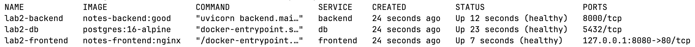

Ура, все контейнеры поднялись и исправно (healthy) работают и общаются между собой, ну а сайт доступен:

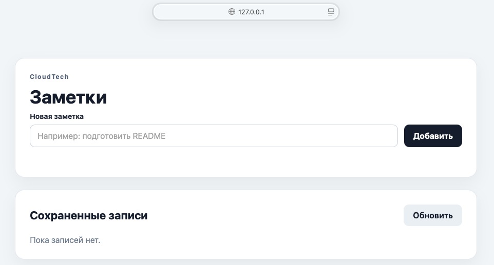

#### Персистентность данных

Создадим записи в базе:

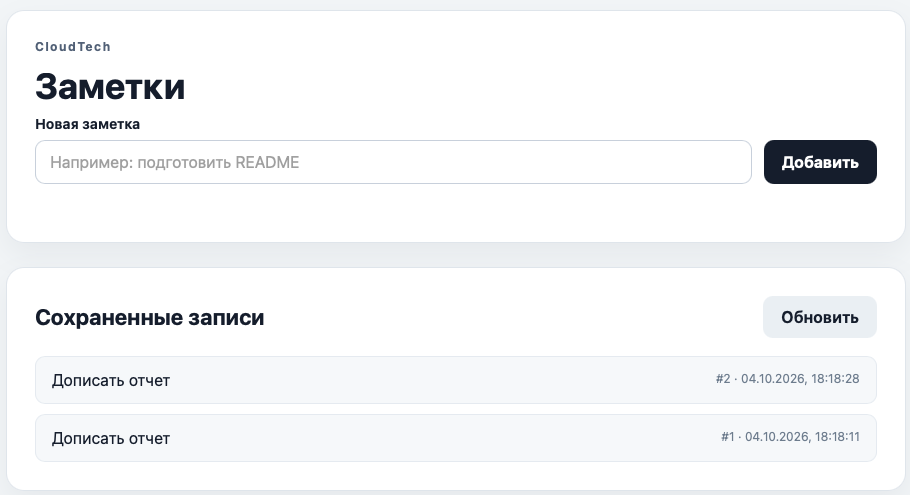

Теперь сначала удалим контейнер БД:

```bash
docker rm -f lab2-db
```


Снова создадим его и проверим, что наши данные не пропали:

```bash
docker compose up -d db
```

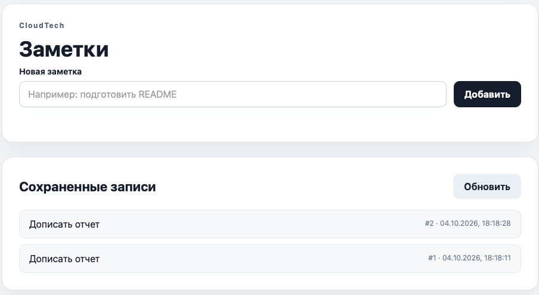

Видим, что записи сохранились, потому что данные находятся в именованном volume и не удаляются вместе с контейнером.

#### Сетевая изоляция

Посмотрим, что будет при попытке frontend достучаться до db:

```bash
docker exec lab2-frontend ping db
```

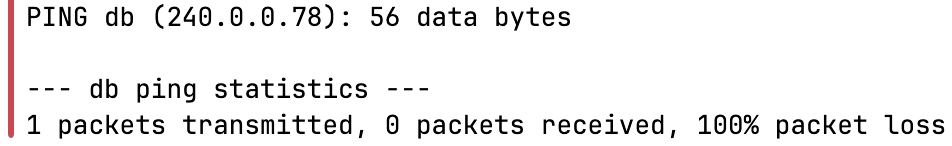

Наблюдаем то, что и ожидали - команда завершилась ошибкой (ни один пакет не дошел), потому что frontend не подключен к
сети `backend_net`. При этом запрос через backend, как мы уже убедились выше, проходит. То есть frontend не имеет
прямого сетевого доступа к db, а с db общается только backend.

#### Healthcheck, depends_on и автоматический перезапуск (часть со звездочкой)

В `docker-compose.yml` мы уже настроили:

- `healthcheck` - отвечает за проверку готовности сервисов
- `depends_on` - отвечает за запуск одного сервиса только после готовности другого (в нашем случае backend после db, а
  frontend после backend)
- `restart: unless-stopped` - отвечет за автоматический перезапуск контейнера после аварийного завершения работы

Проверим автоматический перезапуск db, имитируя аварийное падение главного процесса контейнера с БД во время работы:

```bash
docker exec lab2-db kill -QUIT 1
```

Спустя некоторое время, проверим состояние сервисов:

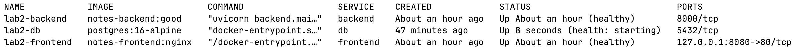

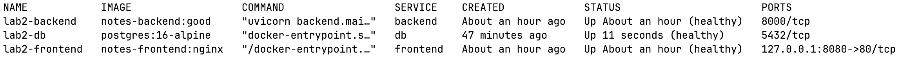

Видим, что Docker автоматически поднял контейнер db снова.

Теперь проверим, что после восстановления контейнера db приложение продолжает работать
(`curl http://127.0.0.1:8080/api/notes`):


Видим, что backend снова подключился к db и сайт продолжает отвечать.

#### Лимиты CPU и RAM (часть со звездочкой)

Для создания нагрузки будем использовать утилиту `ab` и одновременно наблюдать за использованием ресурсов через
`docker stats`. Также в конфиге NGINX временно закомментируем строчки, отвечающие за ограничение запросов.

Запустим нагрузку:

```bash
# -n 10000 - общее количество запросов, -c 100 - количество параллельных запросов
ab -n 10000 -c 100 http://127.0.0.1:8080/api/notes
```

Т.к. запрос проходит через `frontend` к `backend`, который в свою очередь обращается к `db`, то под нагрузкой
оказываются все три сервиса. Будем постепенно подбирать лимиты на примере сервиса `backend`.

При слишком маленьком значении:

```yaml
cpus: "0.05"
mem_limit: 30m
```

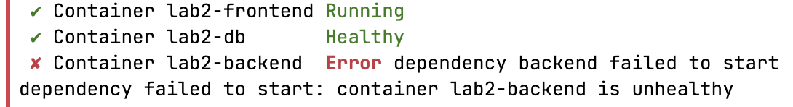


`backend` не смог пройти `HEALTHCHECK` и перешел в состояние `unhealthy`, то есть такого количества CPU оказалось
недостаточно даже для стабильного запуска сервиса. При этом память была заполнена на `100%`, то есть был достигнут
установленный лимит памяти и получено завершение контейнера из-за OOM (Out Of Memory).

Немного увеличим лимит:

```yaml
cpus: "0.10"
mem_limit: 40m
```

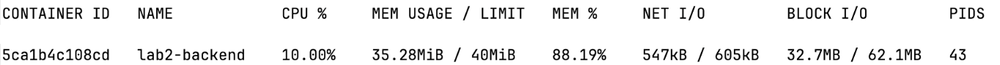

Во время нагрузки в `docker stats` использование CPU доходит ровно до `10%`, то есть `backend` упирается в установленный
предел CPU - наблюдаем троттлинг. При этом использование памяти доходит примерно до `35 m` из доступных `40 m`.

Увеличим CPU еще раз:

```yaml
cpus: "0.20"
mem_limit: 40m
```


При повторной нагрузке использование CPU иногда доходило почти до `20%`, а память практически полностью занимала
установленный лимит `40 m`.

Поэтому мы решили оставить запас ресурсов примерно в `30%`, чтобы сервис смог пережить кратковременное увеличение
нагрузки и это не приводило к тротлингу, OOM или остановке контейнера.

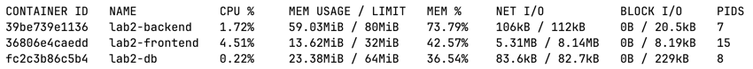

Таким же способом подобрали параметры CPU и RAM для сервисов `frontend` и `db`.

В итоге получили следующие значения:

| Сервис   |  CPU |  RAM |
|----------|-----:|-----:|
| frontend | 0.10 | 32 m |
| backend  | 0.25 | 80 m |
| db       | 0.05 | 64 m |

---

## Выводы

Еще раз зафиксируем то, что нам показалось наиболее важным и интересным после выполнения работы:

1. Порядок слоев в Dockerfile сильно влияет на кеширование и скорость повторной сборки.
2. Использование multi-stage build и облегченного базового образа позволяет существенно уменьшить размер итогового
   образа.
3. Docker Compose позволяет связать все части приложения воедино и управлять ими.
4. `volume` сохраняет данные даже после удаления и пересоздания контейнера.
5. Разделение сервисов по разным сетям позволяет ограничить прямой доступ между контейнерами.
6. `healthcheck` и `depends_on` помогают контролировать состояние сервисов и запускать зависимые контейнеры только после
   старта предшествующих им.
7. Ограничения по CPU и RAM помогают контролировать потребление ресурсов контейнерами, но с ними нужно быть осторожным,
   чтобы не добавить проблем.